# Documentatie

Nume: Gheorghiță Gina Simina  
Grupa: 1146 SIMPRE

## Linkuri utile

- Aplicație live: https://student-planner-cloud-computing.vercel.app/  
- Repository GitHub: https://github.com/GinaSimina2903/StudentPlannerCloudComputing.git  
- Videoclip demo: https://youtu.be/d-8RKukPZys

# Student Planner

Student Planner este o aplicație web destinată gestionării activităților academice ale unui student. Aplicația permite utilizatorilor să își creeze un cont, să se autentifice și să gestioneze activități precum teme, examene, proiecte sau task-uri personale. Scopul aplicației este de a oferi o soluție simplă și accesibilă pentru organizarea activităților unui student, folosind servicii cloud moderne.

Proiectul utilizează servicii cloud pentru autentificare, stocarea datelor, încărcarea fișierelor, trimiterea reminderelor prin email și publicarea aplicației online.

---

## Funcționalități

Aplicația include următoarele funcționalități:

- înregistrare utilizator;
- autentificare utilizator;
- sesiune persistentă după refresh;
- adăugare activități;
- editare activități;
- ștergere activități;
- marcarea activităților ca finalizate/nefinalizate;
- asocierea unei categorii pentru fiecare activitate;
- setarea unui deadline;
- setarea unei priorități;
- filtrarea activităților după categorie și status;
- atașarea unui fișier pentru o activitate;
- trimiterea unui reminder prin email.

Categoriile disponibile pentru activități:

- Temă;
- Examen;
- Proiect;
- Personal.

Prioritățile disponibile:

- Scăzută;
- Medie;
- Ridicată.

---

## Tehnologii utilizate

Proiectul a fost dezvoltat folosind următoarele tehnologii:

- **React** – pentru dezvoltarea interfeței web;
- **Firebase Authentication** – pentru autentificarea utilizatorilor;
- **Firebase Firestore** – pentru stocarea datelor în cloud;
- **Cloudinary** – pentru încărcarea și stocarea fișierelor atașate;
- **EmailJS** – pentru trimiterea reminderelor prin email;
- **Vercel** – pentru publicarea aplicației online;
- **GitHub** – pentru versionarea și publicarea codului sursă.

---

## Servicii cloud utilizate + Descriere API

Aplicația integrează mai multe servicii cloud:

### 1. Firebase Authentication

Firebase Authentication este utilizat pentru înregistrarea și autentificarea utilizatorilor. Acest serviciu permite utilizatorilor să își creeze cont folosind email și parolă, să se autentifice și să rămână logați după refresh.

Operații utilizate:
- creare cont utilizator;
- autentificare utilizator;
- menținerea sesiunii după refresh;
- logout.

Exemplu logic de request:

POST /accounts:signUp

Request:
```json
{
  "email": "student@example.com",
  "password": "parola123",
  "returnSecureToken": true
}
```

Response:
```json
{
  "localId": "user_id",
  "email": "student@example.com",
  "idToken": "token_autentificare"
}
```

### 2. Firebase Firestore

Firebase Firestore este utilizat ca bază de date cloud. În această bază de date sunt salvate activitățile create de utilizatori. Fiecare activitate este asociată cu utilizatorul autentificat prin câmpul `userId`.

Metode echivalente utilizate:
- POST / CREATE pentru adăugarea unei activități;
- GET / READ pentru citirea activităților;
- PATCH / UPDATE pentru editarea unei activități;
- DELETE pentru ștergerea unei activități.

Exemplu document salvat în Firestore:
```json
{
  "title": "Proiect Cloud Computing",
  "description": "Finalizare documentație și video",
  "category": "Proiect",
  "deadline": "2026-05-08",
  "priority": "Ridicată",
  "completed": false,
  "userId": "id_utilizator",
  "createdAt": "data_crearii"
}
```

### 3. Cloudinary

Cloudinary este utilizat pentru încărcarea și stocarea fișierelor atașate activităților. După încărcarea unui fișier, aplicația salvează în Firestore informații precum numele fișierului, linkul către fișier și identificatorul acestuia.

Metodă HTTP: POST  
Endpoint folosit: `https://api.cloudinary.com/v1_1/{cloud_name}/upload`

Request:
- file: fișierul selectat de utilizator;
- upload_preset: presetul configurat în Cloudinary.

Response:
```json
{
  "secure_url": "https://res.cloudinary.com/...",
  "public_id": "id_fisier",
  "original_filename": "nume_fisier"
}
```

Linkul fișierului este apoi salvat în Firestore în câmpul `attachmentUrl`.

### 4. EmailJS

EmailJS este utilizat pentru trimiterea reminderelor prin email. Utilizatorul poate trimite un email de reminder pentru o activitate, pe baza informațiilor salvate în aplicație.

Metodă HTTP: POST

Date transmise:
```json
{
  "to_email": "student@example.com",
  "title": "Proiect Cloud Computing",
  "deadline": "2026-05-08",
  "category": "Proiect",
  "priority": "Ridicată",
  "message": "Reminder pentru activitate"
}
```

Response:
```json
{
  "status": 200,
  "text": "OK"
}
```

### 5. Vercel

Vercel este utilizat pentru găzduirea aplicației web. Aplicația este conectată la repository-ul GitHub și poate fi publicată online printr-un proces automat de deploy.

---

## Structura datelor în Firestore

Datele aplicației sunt salvate în colecția `tasks`.

Fiecare document din colecția `tasks` conține următoarele câmpuri:

```txt
title
description
category
deadline
priority
completed
userId
createdAt
attachmentName
attachmentUrl
attachmentId
```

Descrierea câmpurilor:

- `title` – titlul activității;
- `description` – descrierea activității;
- `category` – categoria activității: Temă, Examen, Proiect sau Personal;
- `deadline` – data limită pentru activitate;
- `priority` – prioritatea activității;
- `completed` – statusul activității, finalizată sau nefinalizată;
- `userId` – identificatorul utilizatorului autentificat;
- `createdAt` – data la care a fost creată activitatea;
- `attachmentName` – numele fișierului atașat;
- `attachmentUrl` – linkul către fișierul încărcat;
- `attachmentId` – identificatorul fișierului în Cloudinary.

Câmpul `userId` este important deoarece permite separarea datelor între utilizatori. Astfel, fiecare utilizator poate vizualiza și modifica doar propriile activități.

---

## Fluxul aplicației

Fluxul principal al aplicației este următorul:

1. Utilizatorul își creează un cont sau se autentifică.  
   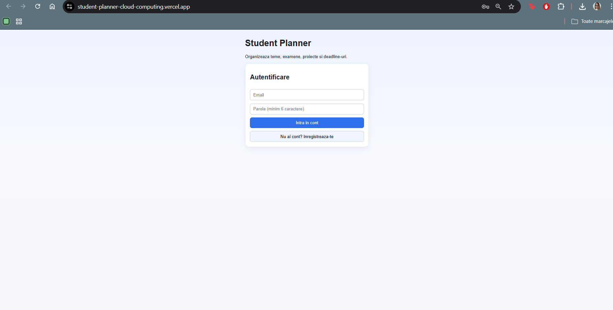  
   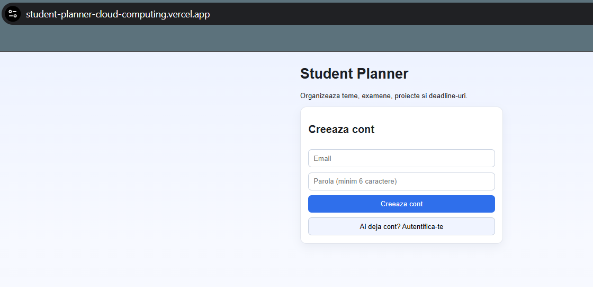

2. Firebase Authentication validează datele de autentificare.  
   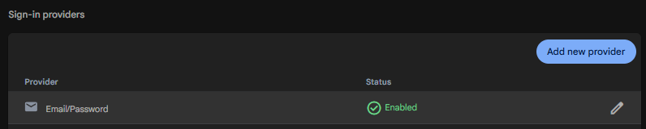

3. După autentificare, utilizatorul este redirecționat către dashboard.  
   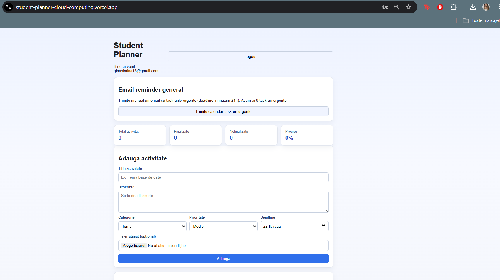

4. În dashboard, utilizatorul poate gestiona activitățile personale.

5. Activitățile create sunt salvate în Firebase Firestore.  
   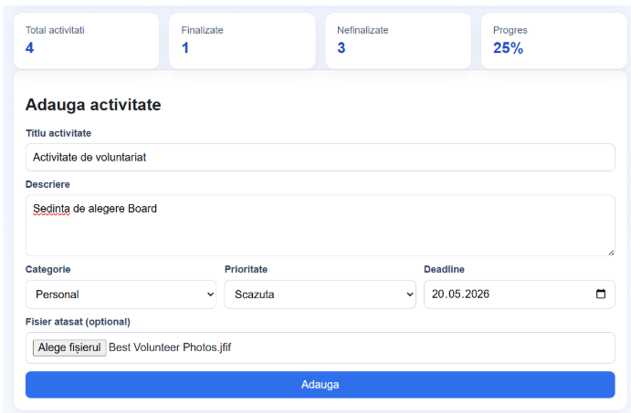  
   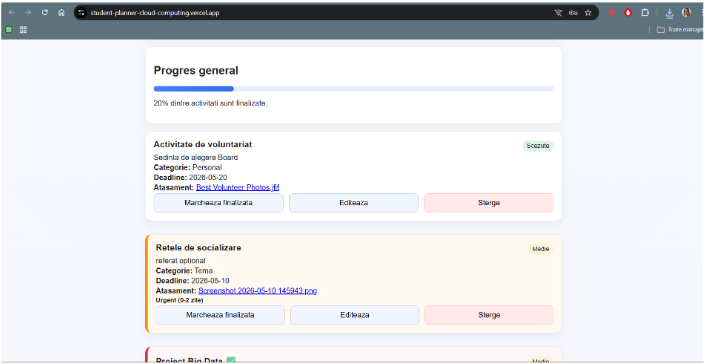

6. Fiecare activitate este asociată cu utilizatorul autentificat prin `userId`.

7. Utilizatorul poate adăuga, edita, șterge, filtra sau marca activitățile ca finalizate.  
   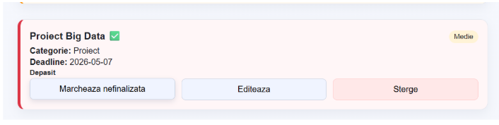  
   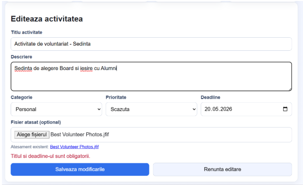  
   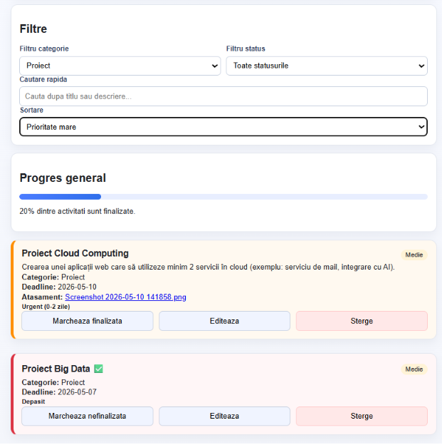

8. Pentru o activitate se poate încărca un fișier atașat prin Cloudinary.  
   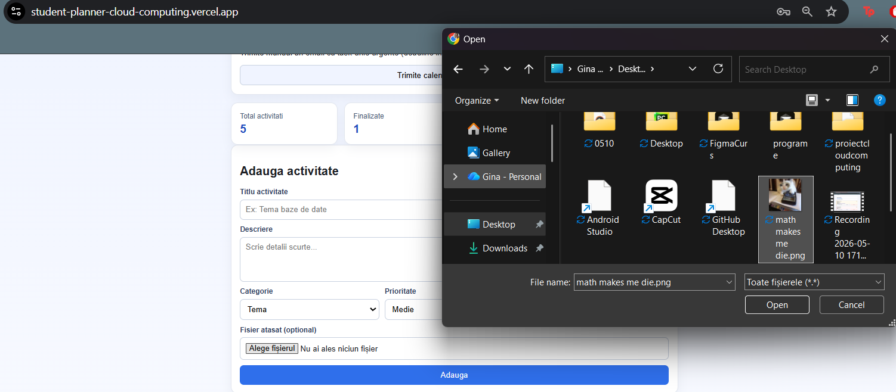

9. Utilizatorul poate trimite un reminder prin email folosind EmailJS.  
   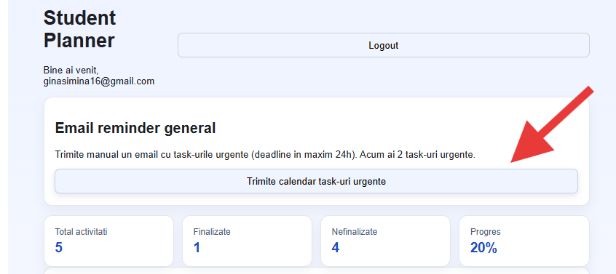

10. Sesiunea utilizatorului rămâne activă după refresh datorită mecanismului de persistență oferit de Firebase Authentication.

### Metode HTTP utilizate

| Serviciu                | Operație              | Metodă HTTP  |
|-------------------------|-----------------------|--------------|
| Firebase Authentication | Register/Login        | POST         |
| Firestore               | Citire activități     | GET / READ   |
| Firestore               | Adăugare activitate   | POST / CREATE|
| Firestore               | Editare activitate    | PATCH / UPDATE|
| Firestore               | Ștergere activitate   | DELETE       |
| Cloudinary              | Upload fișier         | POST         |
| EmailJS                 | Trimitere email       | POST         |

---

## Configurare locală

Pentru rularea locală a proiectului este necesară instalarea dependențelor:

```bash
npm install
```

Proiectul utilizează variabile de mediu. Se creează un fișier `.env` pe baza fișierului `.env.example`.

Exemplu de variabile necesare:

```env
VITE_FIREBASE_API_KEY=
VITE_FIREBASE_AUTH_DOMAIN=
VITE_FIREBASE_PROJECT_ID=
VITE_FIREBASE_STORAGE_BUCKET=
VITE_FIREBASE_MESSAGING_SENDER_ID=
VITE_FIREBASE_APP_ID=

VITE_CLOUDINARY_CLOUD_NAME=
VITE_CLOUDINARY_UPLOAD_PRESET=

VITE_EMAILJS_SERVICE_ID=
VITE_EMAILJS_TEMPLATE_ID=
VITE_EMAILJS_PUBLIC_KEY=
```

După completarea variabilelor de mediu, aplicația poate fi pornită local cu următoarea comandă:

```bash
npm run dev
```

---

## Configurare Firebase

Pași realizați pentru configurarea Firebase:

1. Crearea unui proiect în Firebase Console.  
2. Înregistrarea aplicației web în cadrul proiectului Firebase.  
3. Activarea serviciului Firebase Authentication.  
4. Activarea metodei de autentificare Email/Password.  
5. Activarea bazei de date Firestore.  
6. Copierea configurației Firebase în fișierul `.env`.

Firebase Authentication este folosit pentru login și register, iar Firestore este folosit pentru stocarea activităților.

---

## Reguli Firestore

Pentru protejarea datelor, accesul la documentele din colecția `tasks` este permis doar utilizatorului autentificat care deține activitatea respectivă.

Regulile folosite în Firestore:

```txt
rules_version = '2';
service cloud.firestore {
  match /databases/{database}/documents {
    match /tasks/{taskId} {
      allow create: if request.auth != null
                    && request.auth.uid == request.resource.data.userId;

      allow read, update, delete: if request.auth != null
                                  && request.auth.uid == resource.data.userId;
    }
  }
}
```

Aceste reguli permit:

- crearea unei activități doar dacă utilizatorul este autentificat;
- citirea unei activități doar de către utilizatorul care a creat-o;
- editarea unei activități doar de către utilizatorul care a creat-o;
- ștergerea unei activități doar de către utilizatorul care a creat-o.

---

## Configurare Cloudinary

Cloudinary este utilizat pentru încărcarea fișierelor atașate unei activități.

Pașii de configurare:

1. Crearea unui cont Cloudinary.  
2. Copierea valorii `Cloud name` din dashboard.  
3. Crearea unui upload preset.  
4. Setarea upload preset-ului ca `Unsigned`.  
5. Salvarea valorilor în fișierul `.env`.

Variabilele utilizate pentru Cloudinary:

```env
VITE_CLOUDINARY_CLOUD_NAME=
VITE_CLOUDINARY_UPLOAD_PRESET=
```

---

## Configurare EmailJS

EmailJS este utilizat pentru trimiterea reminderelor prin email.

Pașii de configurare:

1. Crearea unui cont EmailJS.  
2. Crearea unui Email Service.  
3. Crearea unui template de email.  
4. Definirea variabilelor folosite în template.  
5. Copierea valorilor Service ID, Template ID și Public Key în fișierul `.env`.

Variabilele utilizate pentru EmailJS:

```env
VITE_EMAILJS_SERVICE_ID=
VITE_EMAILJS_TEMPLATE_ID=
VITE_EMAILJS_PUBLIC_KEY=
```

Template-ul de email folosește următoarele variabile:

```txt
to_email
title
deadline
category
priority
message
```

---

## Deploy

Aplicația este publicată folosind Vercel.

Pașii generali pentru deploy:

1. Codul sursă este încărcat într-un repository GitHub.  
2. Repository-ul este importat în Vercel.  
3. Variabilele de mediu sunt configurate în secțiunea Environment Variables din Vercel.  
4. Aplicația este construită și publicată automat.

Variabilele de mediu necesare în Vercel (aceleași ca local):

```env
VITE_FIREBASE_API_KEY=
VITE_FIREBASE_AUTH_DOMAIN=
VITE_FIREBASE_PROJECT_ID=
VITE_FIREBASE_STORAGE_BUCKET=
VITE_FIREBASE_MESSAGING_SENDER_ID=
VITE_FIREBASE_APP_ID=

VITE_CLOUDINARY_CLOUD_NAME=
VITE_CLOUDINARY_UPLOAD_PRESET=

VITE_EMAILJS_SERVICE_ID=
VITE_EMAILJS_TEMPLATE_ID=
VITE_EMAILJS_PUBLIC_KEY=
```

---

## Linkuri proiect

Documentație:

Repository GitHub:

```txt
https://github.com/GinaSimina2903/StudentPlannerCloudComputing.git
```

Aplicație live:

```txt
https://student-planner-cloud-computing.vercel.app/
```

---

## Cerințe îndeplinite

Aplicația îndeplinește cerințele proiectului astfel:

- utilizează cel puțin două servicii cloud;
- include autentificare pentru utilizatori;
- menține sesiunea utilizatorului după refresh;
- salvează datele într-o bază de date cloud;
- permite gestionarea datelor de către utilizator;
- include cod sursă publicat pe GitHub;
- este publicată online folosind Vercel;
- integrează servicii cloud suplimentare pentru fișiere și email.

Serviciile cloud utilizate sunt:

- Firebase Authentication;
- Firebase Firestore;
- Cloudinary;
- EmailJS;
- Vercel.

---

## Concluzie

Student Planner demonstrează utilizarea mai multor servicii cloud într-o aplicație web funcțională. Aplicația integrează autentificare, bază de date cloud, stocare de fișiere, trimitere de emailuri și publicare online.

Soluția este potrivită pentru organizarea activităților academice ale unui student și poate fi extinsă ulterior cu funcționalități suplimentare, precum notificări automate, calendar, statistici privind activitățile finalizate sau integrare cu alte servicii educaționale.